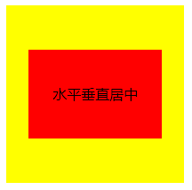
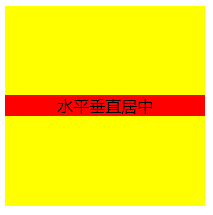
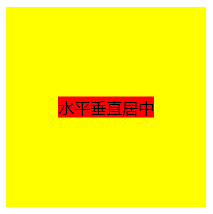
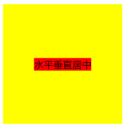

>  不要仅仅看，而不去实际操作写代码看效果；
>
> 也许一看就懂，而实战中却需要查阅资料或笔记才能完成的话，就更要自己动手写写了，切忌眼高手低！

```html
<!DOCTYPE html>
<html lang="en">
<head>
  <meta charset="UTF-8">
  <meta name="viewport" content="width=device-width, initial-scale=1.0">
  <meta http-equiv="X-UA-Compatible" content="ie=edge">
  <title>水平垂直居中</title>
  <style>
    /* 1.已知元素宽度高度大小  absolute， left top right bottom 0; margin auto*/
    /* .parent {
      position: relative;
      width: 200px;
      height: 200px;
      background-color: #ffff00;
    }
    .child {
      width: 150px;
      height: 100px;
      background-color: #ff0000;
      position: absolute;
      left: 0;
      right: 0;
      top: 0;
      bottom: 0;
      margin: auto;

      line-height: 100px;
      text-align: center;
    } */

  /* 2.已知元素高度宽度大小，absolute， left top 50%; 
       margin-left：-width/2; margin-top: -height/2; */
  /* .parent {
    position: relative;
    width: 200px;
    height: 200px;
    background-color: #ffff00;
  }
  .child {
    position: absolute;
    width: 150px;
    height: 100px;
    top: 50%;
    left: 50%;
    margin-top: -50px;
    margin-left: -75px;
    background-color: #ff0000;

    line-height: 100px;
    text-align: center
  } */

  /* 3. 已知元素高度宽度大小 display：table-cell， text-align: center， veryical: middle */
  /* .parent {
    position: relative;
    width: 200px;
    height: 200px;
    background-color: #ffff00;

    display: table-cell; 
    text-align: center; //水平居中
    vertical-align: middle; //垂直居中
  }
  .child {
    background-color: #ff0000;
  } */

  /* 4.元素大小未知，absolute， transform: translate(-50%,-50%)  */
  /* .parent {
    position: relative;
    width: 200px;
    height: 200px;
    background-color: #ffff00;
  }
  .child{
    position: absolute;
    top: 50%;
    left: 50%;
    transform: translate(-50%,-50%);
    background-color: #ff0000;
  } */

  /* 5.元素大小未知， flex布局 */
  /* .parent {
    position: relative;
    width: 200px;
    height: 200px;
    background-color: #ffff00;

    display: flex;
    justify-content: center;
    align-items: center;
  }
  .child {
    background-color: #ff0000;
  } */
  </style>
</head>
<body>
  <div class="parent">
    <div class="child">水平垂直居中</div>
  </div>
</body>
</html>

```

#### 已知元素宽高大小

1. absolute，left  top right bottom 0;  margin auto（此时必须知道元素宽高）

   ```css
     .parent {
         position: relative;
         width: 200px;
         height: 200px;
         background-color: #ffff00;
       }
       .child {
         width: 150px;
         height: 100px;
         background-color: #ff0000;
         position: absolute;
         left: 0;
         right: 0;
         top: 0;
         bottom: 0;
         margin: auto;
   
         line-height: 100px;
         text-align: center;
       } 
   ```

   

2. absolute， left  top 50%;  margin-left：-width/2; margin-top: -height/2;(此时必须知道元素宽高)

   ```css
     .parent {
       position: relative;
       width: 200px;
       height: 200px;
       background-color: #ffff00;
     }
     .child {
       position: absolute;
       width: 150px;
       height: 100px;
       top: 50%;
       left: 50%;
       margin-top: -50px;
       margin-left: -75px;
       background-color: #ff0000;
   
       line-height: 100px;
       text-align: center
     }
   ```

   

3. display：table-cell， text-align: center， veryical: middle (此时必须知道元素宽高)

    虽然已经水平垂直居中，但是给子元素加上背景色后就发现不一样的地方，其实是子元素的宽度继承了父元素造成的；

   ```css
     .parent {
       position: relative;
       width: 200px;
       height: 200px;
       background-color: #ffff00;
   
       display: table-cell; 
       text-align: center; //水平居中
       vertical-align: middle; //垂直居中
     }
     .child {
       background-color: #ff0000;
     } 
   ```

   

#### 未知元素宽高大小

1. absolute， transform: translate(-50%,-50%)  ;若translate(0,-50%)则为垂直居中，translate(-50%，0)则为水平居中；所以都是互通的，其实水平居中，垂直居中会了，水平垂直居中也就水到渠成；

   ```
     .parent {
       position: relative;
       width: 200px;
       height: 200px;
       background-color: #ffff00;
     }
     .child{
       position: absolute;
       top: 50%;
       left: 50%;
       transform: translate(-50%,-50%);
       background-color: #ff0000;
     } 
   ```

   

2. flex布局，justify-content: center; 水平居中  align-items: center;垂直居中

   ```
    .parent {
       position: relative;
       width: 200px;
       height: 200px;
       background-color: #ffff00;
   
       display: flex;
       justify-content: center;
       align-items: center;
     }
     .child {
       background-color: #ff0000;
     } 
   ```

   

## 小结：

> 方法不在多，而在精；善于在不同场景进行不用的方法处理，灵活变通即可。[参考链接](https://segmentfault.com/a/1190000014116655)

